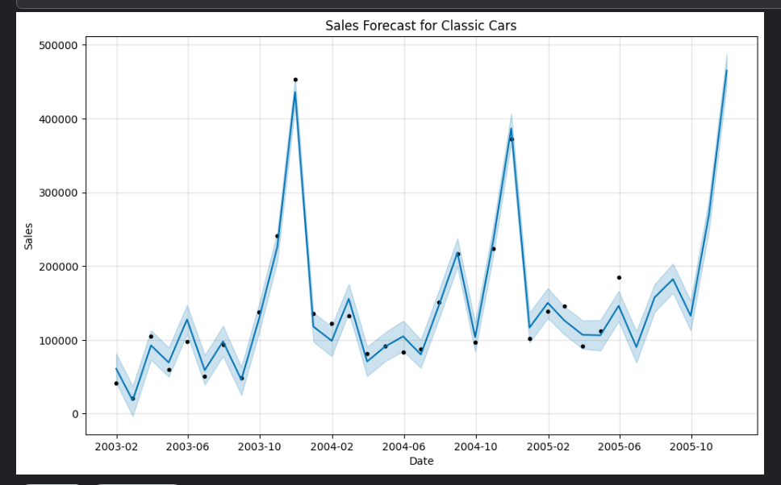
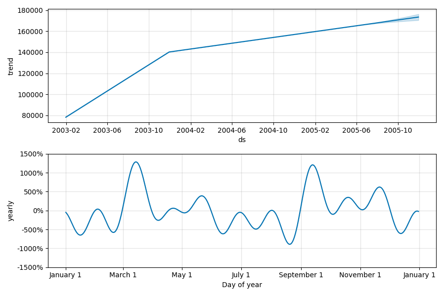
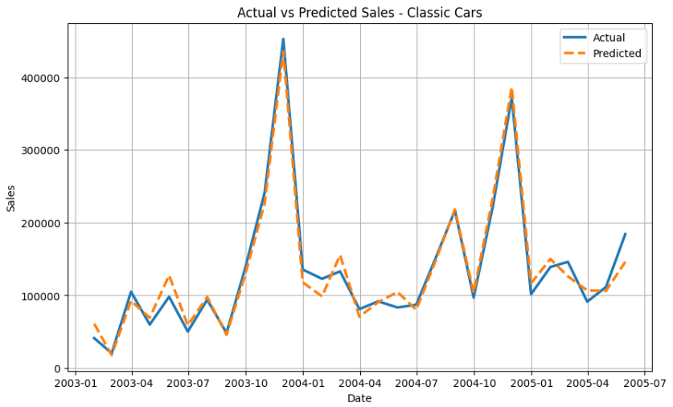

📊 Task 1 – Sales Forecasting with Prophet

As part of my Machine Learning Internship at Future Interns, I built a time series forecasting model using historical sales data and the Prophet library to predict future sales.

---

📦 Dataset
- [Kaggle: Sample Sales Data](https://www.kaggle.com/datasets/kyanyoga/sample-sales-data)

---

🔍 Project Objective
To forecast monthly sales for the product line **Classic Cars** using Prophet with multiplicative seasonality.

---

 🛠 Tools Used
 -Kaggle
- Python
- Pandas, Seaborn, Matplotlib
- Prophet (Facebook)
- Plotly (for interactive graphs)
- Scikit-learn (for evaluation metrics)

 🔢 Model Evaluation
| Metric | Value |
|--------|--------|
| MAE    | 12,984.95 |
| RMSE   | 15,625.57 |
| MAPE   | 12.29% |

---

📈 Forecast Insights

- 🔍 **Peak Month**: November 2005  
- 💰 **Predicted Peak Sales**: $465,133.21  
- 📈 **Year-over-Year Sales Growth**: 14.98%

---

 📸 Visualizations

# 1. Forecast Plot  

 2. Trend & Seasonality Components  

 3. Actual vs Predicted Comparison  

 4. Interactive Forecast Plot 

## 🔧 Future Improvements

While this project successfully forecasts future sales using Prophet, the following improvements could further enhance the model’s performance and business value:

- **Add More Regressors:** Include external features like marketing campaigns, holidays, or pricing changes as additional regressors in the model.
- **Train on Multiple Product Lines Simultaneously:** Loop through all `ProductLine` categories and forecast for each to build a complete retail forecasting system.
- **Switch to Daily Forecasting:** Use daily-level forecasts for shorter-term operational planning (e.g., delivery logistics, warehouse stocking).
- **Hyperparameter Tuning:** Experiment with Prophet’s changepoint parameters, seasonality scale, and holidays for better accuracy.
- **Use Advanced ML Models for Comparison:** Test other models like ARIMA, SARIMA, or LSTM to benchmark performance against Prophet.
- **Deploy as a Web Dashboard:** Create a real-time dashboard using Streamlit or Gradio to let users select categories and visualize forecasts dynamically.
- **Automate Reporting:** Set up scheduled scripts to re-train the model monthly and email insights to stakeholders automatically.

These steps would turn the current standalone analysis into a fully automated, business-ready forecasting pipeline.

---
 💡 Business Use Case

This forecasting solution helps businesses:
- Anticipate product demand
- Plan inventory ahead of peak months
- Align promotions with seasonality

---

## 🔗 Useful Links

- 📘 [Kaggle Notebook](https://www.kaggle.com/code/miftameme/future-ml-01-salesforecasting)
- 📣 [LinkedIn Post](INSERT_LINKEDIN_POST_LINK_HERE)

---
